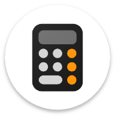

# Alright Calculator

Alright Calculator is a clean, open-source calculator that respects your privacy. No ads. No trackers. No permissions. Just fast, reliable calculations with a fully customizable interface — switch themes, adjust colors, and make it yours. Your data stays on your device, always.

## ☕ Support the Project

If you find **Alright Calculator** useful and would like to support its development, consider
buying me a coffee! Your support helps me maintain and improve this project.

*Every contribution, no matter how small, helps keep this project alive and growing! ❤️*   

*Based on [Simple Calculator](hhttps://github.com/SimpleMobileTools/Simple-Calculator), [Fossify Calculator](https://github.com/FossifyOrg/Calculator).*
